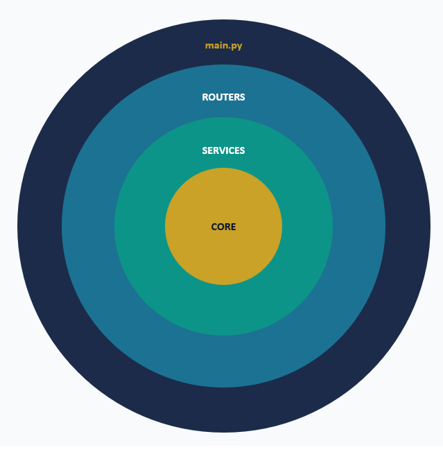

# Chess Rekognition API

Bienvenido/a a la documentación de la API de Chess Rekognition.

Esta API construida con **FastAPI** se encarga de:

- Procesamiento de las imágenes del tablero de ajedrez.
- Reconocimiento y corrección de la homografía del tablero de ajedrez.
- Recorte y detección de piezas y manos sobre el tablero rectificado con **YOLO26 (Ultralytics)**.
- Reconocimiento de las piezas.
- Lógica de juego mediante Stockfish.
- Gestión de usuarios.
- Guardado de partidas en PGN.
- Retransmisión en tiempo real mediante WebSockets (estado FEN/PGN y relay opcional de vídeo en directo).

**¿Qué es FastAPI?** FastAPI es un framework web Python de alto rendimiento para construir APIs REST, con soporte nativo para operaciones asíncronas (`async/await`) y generación automática de documentación interactiva en formato OpenAPI/Swagger.

Sobre FastAPI se construyen todos los endpoints REST (login, registro, CRUD de partidas, Stockfish, retransmisiones) y también los WebSockets para la retransmisión en tiempo real. Se sirve con **Uvicorn** (servidor ASGI) y está desplegado en **Railway**.

La documentación automática está disponible en:
**https://chess-rekognition-api-production.up.railway.app/docs**

**Bibliografía:**
- Documentación oficial: https://fastapi.tiangolo.com
- Repositorio: https://github.com/fastapi/fastapi
- Tutorial oficial completo: https://fastapi.tiangolo.com/tutorial/

## Colabora con el DATASET del Modelo

Colabora para hacer un mejor DATASET clasificando tus fotos de tableros con piezas de tipo Staunton:

- [Anotación semi-automática de bounding boxes y entrenamiento del detector YOLO26](https://chess-rekognition-api-production.up.railway.app/yolo-dataset) — las cajas se pre-rellenan desde las predicciones del detector YOLO (si el modelo está entrenado) y solo hay que corregirlas; incluye la clase `hand` (manos sobre el tablero).
- [Gestión de clases, bounding boxes y modelo YOLO26](https://chess-rekognition-api-production.up.railway.app/yolo-manage) — consultar y borrar cajas, clases y el modelo entrenado.
- [Prueba del detector YOLO26 en directo](https://chess-rekognition-api-production.up.railway.app/yolo)

## Estructura de archivos

```
api/
├── main.py                 # Punto de entrada de FastAPI
├── Procfile                # Comando de inicio para el despliegue automático en Railway
├── iniciar.bat             # Script para arrancar el API en local (Windows)
├── requirements.txt        # Dependencias de Python necesarias para la API
│
├── core/                   # Capa CORE
│   ├── config.py           # Configuración del entorno (.env) con patrón Singleton (@lru_cache)
│   ├── security.py         # Hasheo de contraseñas con bcrypt y utilidades criptográficas de JWT
│   ├── dependencies.py     # Inyectores de dependencia (Depends) de sesión DB y usuario actual
│   ├── database.py         # Configuración de base de datos MySQL e inicialización del motor ORM
│   └── models.py           # Definición ORM (SQLAlchemy) y esquemas de validación (Pydantic DTOs)
│
├── routers/                # Capa ROUTERS
│   ├── auth.py             # Rutas de login, refresh de sesión y whoami
│   ├── usuarios.py         # Registro de usuarios
│   ├── partidas.py         # CRUD de partidas PGN
│   ├── engine.py           # Motor StockFish v17.1
│   ├── vision.py           # Endpoints de diagnóstico OpenCV, detección YOLO26 y detección de jugadas
│   ├── retransmision.py    # Gestión de salas activas y WebSockets de emisores y espectadores (estado + relay de vídeo)
│   ├── yolo_dataset.py     # Dataset YOLO: guardado de imágenes + etiquetas .txt, estadísticas y entrenamiento del detector
│   └── yolo_model.py       # Gestión del modelo YOLO26: clases, bounding boxes del dataset y borrado del modelo
│
├── services/               # Capa SERVICES
│   ├── vision.py           # Servicio para la rectificación de la homografía con OpenCV para la detección y rectificación del tablero de ajedrez.
│   ├── yolo_detector.py    # Servicio de detección de piezas/manos con YOLO26 sobre el tablero rectificado + mapeo bbox → casilla.
│   ├── engine_stats.py     # Evaluación de métricas YOLO sobre el dataset de validación.
│   ├── move_detector.py    # Servicio de detección de movimientos de ajedrez mediante comparación visual.
│   ├── engine.py           # Servicio de integración con el motor de ajedrez Stockfish v17.1.
│   ├── yolo_training.py    # Servicio de entrenamiento del detector YOLO26 (split train/val determinista por hash).
│   └── email.py            # Servicio de envío de emails transaccionales mediante la API de Resend (https://resend.com).
│
├── data/
│   ├── models/             # Modelos entrenados (yolo_chess.pt — futuro, pendiente de entrenar)
│   └── yolo_dataset/       # Dataset YOLO26
│       ├── images/         # Imágenes del tablero rectificado 400x400 (.jpg)
│       ├── labels/         # Ficheros .txt con bounding boxes en formato YOLO
│       └── fuentes/        # Copia de las imágenes fuente originales para referencia
│
└── static/
    ├── favicon.ico         # Icono de la API
    ├── opencv.html         # Pagina HTML de pruebas OpenCV (Rectificación, homografía del tablero y valores de Desviación Estándar STD)
    ├── yolo_dataset.html   # Pagina HTML de anotación semi-automática del dataset YOLO (bounding boxes) y entrenamiento del detector
    ├── yolo_manage.html    # Pagina HTML de gestión del dataset YOLO26 (clases, bounding boxes, imágenes y modelo)
    └── yolo.html           # Pagina HTML de prueba del detector YOLO26 en directo (cajas de piezas y manos)
```

---

## Arquitectura del Sistema

### Patrón de Diseño: Arquitectura en 3 Capas

El backend sigue una **arquitectura en 3 capas** con separación clara de responsabilidades.



Cada capa tiene una función específica y solo se comunica con la capa inmediatamente inferior:

#### Capa de Presentación

Esta capa es dirigida por el archivo main.py e incluye: 

- Endpoints auxiliares.
- Routers registrados con los endpoints.
- Archivos estáticos.

| Endpoint / Componente | Método | Detalle |
| :--- | :---: | :--- |
| `/` | **GET** | Estado de la API |  |
| `/favicon.ico` | **GET** | Favicon | Sirve static/favicon.ico |
| `/opencv` | **GET** | Pagina HTML de pruebas OpenCV | Sirve static/opencv.html |
| `/yolo-dataset` | **GET** | Pagina HTML de anotación semi-automática del dataset YOLO y entrenamiento del detector YOLO26 | Sirve static/yolo_dataset.html |
| `/yolo-manage` | **GET** | Pagina HTML de gestión del dataset YOLO26 (clases, bounding boxes, imágenes y modelo) | Sirve static/yolo_manage.html |
| `/yolo` | **GET** | Pagina HTML de prueba del detector YOLO26 en directo | Sirve static/yolo.html |
| `/docs` | **GET** | Swagger UI personalizado | Usa get_swagger_ui_html() |
| `CORSMiddleware` | — | Permite peticiones cross-origin desde cualquier origen | `allow_origins=['*']`, methods: GET/POST/PUT/DELETE/OPTIONS/PATCH, credentials=True |
| `include_router(x7)` | — | auth, usuarios, partidas, engine, vision, yolo_dataset, retransmision | app.include_router() para cada modulo del directorio routers/ |

#### Capa Routers

Esta capa contiene los diferentes endpoints y websockets registrados en la capa de presentación (main.py). 

Los diferentes routers con los que cuenta la API y sus correspondientes endpoints son:

##### auth.py

| Endpoint / Componente | Método | Detalle |
| :--- | :---: | :--- |
| `/auth/login` | **POST** | Autentica con username + password y devuelve access token (30 min) y refresh token (7 días). |
| `/auth/refresh` | **POST** | Emite un nuevo access token a partir de un refresh token válido. |
| `/auth/whoami` | **GET** | Devuelve los datos del usuario identificado por el access token. |

##### usuarios.py

| Endpoint / Componente | Método | Detalle |
| :--- | :---: | :--- |
| `/usuarios/register` | **POST** | Registra un nuevo usuario y envía un email de bienvenida via Resend. |

##### partidas.py

| Endpoint / Componente | Método | Detalle |
| :--- | :---: | :--- |
| `/partidas/` | **POST** | Crea una nueva partida asociada al usuario autenticado. |
| `/partidas/` | **GET** | Lista todas las partidas del usuario autenticado, con filtro opcional por tipo (PI: Partida Introducida / PR: Partida Retransmitida). |
| `/partidas/{id_partida}` | **GET** | Obtiene el detalle de una partida por ID. Solo devuelve la partida si pertenece al usuario. |
| `/partidas/{id_partida}` | **PATCH** | Actualiza los campos enviados de una partida del usuario autenticado. |
| `/partidas/{id_partida}` | **DELETE** | Elimina una partida del usuario autenticado. (Actualmente no se usa en la app). |

##### engine.py

| Endpoint / Componente | Método | Detalle |
| :--- | :---: | :--- |
| `/engine/status` | **GET** | Verifica el estado y la versión del motor Stockfish v17.1. |
| `/engine/move` | **POST** | Obtiene la mejor jugada dada una posición en FEN. Parámetros opcionales: elo (1320-3190) y depth (1-30). |

##### vision.py

| Endpoint / Componente | Método | Detalle |
| :--- | :---: | :--- |
| `/vision/status` | **GET** | Devuelve el estado operativo del módulo y la versión de OpenCV. |
| `/vision/recognize-board`| **POST** | Detecta y rectifica el tablero aplicando la homografía. Devuelve vista cenital 400x400 (incluye `rectified_clean` sin overlays). |
| `/vision/detect-yolo` | **POST** | Detecta piezas y manos con YOLO26 sobre el tablero rectificado y, opcionalmente, el movimiento realizado. |
| `/vision/engine-stats` | **POST** | Evalúa YOLO26 sobre la partición de validación (precisión por casilla, FEN exactos, precisión/recall de piezas y tiempo medio). |

##### retransmision.py

| Endpoint / Componente | Método | Detalle |
| :--- | :---: | :--- |
| `/retransmision/host` | **POST** | Crea una nueva retransmisión con token único y la marca como activa. |
| `/retransmision/status/{token}`| **GET** | Devuelve si la retransmisión está activa y cuántos viewers hay conectados. |
| `/retransmision/{id_retransmision}`| **PATCH**| Actualiza los metadatos de una retransmisión del usuario autenticado. |
| `/retransmision/ws/host/{token}`| **WS** | WebSocket del emisor (host): recibe el estado del tablero y hace broadcast a los viewers. También acepta mensajes `{"type": "video_frame", ...}` que se reenvían SIN cachear (relay de vídeo opcional, máx. 200 KB/frame). |
| `/retransmision/ws/viewer/{token}`| **WS** | WebSocket del espectador (viewer): recibe actualizaciones en tiempo real del tablero y, si el host lo comparte, los frames de vídeo en directo. Los late-joiners reciben el último estado FEN/PGN cacheado. |

##### yolo_dataset.py

Dataset del detector YOLO26: imágenes del tablero rectificado 400x400 con etiquetas en formato YOLO normalizado 0-1. Las clases son `w_P, w_N, w_B, w_R, w_Q, w_K, b_P, b_N, b_B, b_R, b_Q, b_K` + `hand` (detección de objetos: sin clase "empty", una zona sin pieza simplemente no tiene caja).

| Endpoint / Componente | Método | Detalle |
| :--- | :---: | :--- |
| `/yolo-dataset/save` | **POST** | Guarda una imagen rectificada y su fichero .txt de bounding boxes (autenticado). |
| `/yolo-dataset/stats` | **GET** | Número de imágenes y cajas por clase, con desglose pre-rellenas/corregidas/manuales (autenticado). |
| `/yolo-dataset/train` | **POST** | Lanza el entrenamiento de YOLO26 en hilo daemon; split train/val determinista por hash (la validación nunca entrena). |
| `/yolo-dataset/train/status` | **GET** | Estado actual del entrenamiento YOLO (polling). |

##### yolo_model.py

Gestión del modelo YOLO26 entrenado: clases, bounding boxes del dataset y borrado del modelo.

| Endpoint / Componente | Método | Detalle |
| :--- | :---: | :--- |
| `/yolo-model/classes` | **GET** | Lista las 13 clases del detector YOLO (12 piezas + hand) con el número de cajas de cada una. (Autenticado). |
| `/yolo-model/boxes` | **GET** | Lista todas las imágenes del dataset con sus bounding boxes. Soporta paginación (`page`, `per_page`) y filtro por clase (`class_filter`). (Autenticado). |
| `/yolo-model/boxes/{image_id}` | **GET** | Detalle de las bounding boxes de una imagen concreta del dataset. (Autenticado). |
| `/yolo-model/boxes/{image_id}/{box_index}` | **DELETE** | Elimina una bounding box concreta (posición 0-indexed) de una imagen. Si queda sin cajas, elimina también la imagen y la fuente. (Autenticado). |
| `/yolo-model/images/{image_id}` | **DELETE** | Elimina una imagen completa del dataset (imagen, anotación .txt y imagen fuente). (Autenticado). |
| `/yolo-model/model` | **DELETE** | Elimina el modelo YOLO entrenado (`yolo_chess.pt`) y recarga el detector (queda "no listo"). (Autenticado). |

#### Capa Services

Esta capa contiene los diferentes servicios asíncronos y síncronos con los que cuenta la API para procesar lógica de negocio compleja.

#### Capa Core

La capa core representa el núcleo de la infraestructura del sistema, gestionando la base de datos, la configuración global y las herramientas transversales de seguridad.

---

## Configuración y Variables de Entorno

| Variable | Descripción | Valor por Defecto |
|----------|-------------|-------------------|
| `DB_HOST` | Host MySQL | — |
| `DB_PORT` | Puerto MySQL | `3306` |
| `DB_USER` | Usuario BD | — |
| `DB_PASSWORD` | Contraseña BD | — |
| `DB_NAME` | Nombre BD | — |
| `JWT_SECRET_KEY` | Clave secreta JWT | — |
| `JWT_ALGORITHM` | Algoritmo JWT | `HS256` |
| `JWT_ACCESS_TOKEN_EXPIRE_MINUTES` | Expiración access token | `30` |
| `JWT_REFRESH_TOKEN_EXPIRE_DAYS` | Expiración refresh token | `7` |
| `RESEND_API_KEY` | API Key de Resend | — |
| `RESEND_FROM` | Email remitente | `onboarding@resend.dev` |
| `MODELS_DIR` | Directorio de modelos | `./data/models` |
| `YOLO_DATASET_DIR` | Directorio del dataset YOLO (imágenes + etiquetas .txt) | `./data/yolo_dataset` |

Constantes relevantes del motor YOLO (en `core/config.py`): `YOLO_CLASSES`, `YOLO_CONF_THRESHOLD`, `YOLO_IOU_THRESHOLD`, `YOLO_IMG_SIZE`, `HAND_MIN_CONFIDENCE`.

---

## Instalación y Ejecución Local

### Opción rápida (Windows): usar `iniciar.bat`

Doble clic en `iniciar.bat` (o ejecutar desde terminal). El script:
1. Verifica que exista el archivo `.env`.
2. Crea el entorno virtual si no existe.
3. Instala las dependencias automáticamente.
4. Arranca el servidor en `http://localhost:8000`.

### Opción manual

```bash
# 1. Crear entorno virtual
python -m venv venv

# 2. Activar entorno virtual
# Windows:
venv\Scripts\activate
# Linux/Mac:
source venv/bin/activate

# 3. Instalar dependencias
pip install -r requirements.txt

# 4. Configurar variables de entorno (.env)
# Ver tabla de configuración arriba

# 5. Ejecutar servidor de desarrollo
uvicorn main:app --reload --host 0.0.0.0 --port 8000
```

## Notas sobre uso de Inteligencia Artificial usada en la implementación:

> Uso de IA generativa como ayuda en la parte del código de la API. Concretamente utilizada en los servicios de reconocimiento visual (rectificación de tablero con OpenCV y detección de piezas con YOLO26/Ultralytics).

---

## Documentación Interactiva

- **Swagger UI**: `http://localhost:8000/docs`
- **ReDoc**: `http://localhost:8000/redoc`
- **OpenAPI JSON**: `http://localhost:8000/openapi.json`

---

## Despliegue (Railway)

La API está preparada para desplegarse en Railway mediante el `Procfile`:

```
web: uvicorn main:app --host 0.0.0.0 --port $PORT
```

Las variables de entorno se configuran desde el panel de Railway. El binario de Stockfish (Linux, ~79 MB) se incluye en el repositorio para su uso en producción.

> **Nota sobre `ultralytics` (YOLO26):** el paquete arrastra PyTorch (~2 GB instalado). Aumenta el build y los arranques en frío del despliegue. La API está preparada para arrancar aunque falte: el motor YOLO queda "no listo" y los endpoints lo indican con un mensaje claro, sin romper el resto del sistema.
